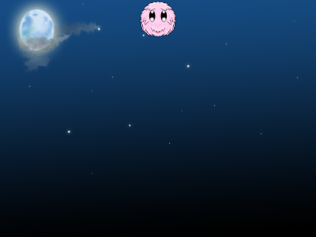

# Phaser.io Game Development for Students

## Unit 1: Fuzzy Balll Bouncing Animation

### Fuzzy Ball Animation 

* 1 quả bóng ở giữa khung hình rơi từ trên xuống dưới và nảy lại vài lần cho đến khi dừng hẳn lại
* Các files html part0 đến part5 hướng dẫn lần lượt các bước tạo nên animation
1. part0.html: template rỗng 
2. part1: Tạo ảnh tĩnh
3. part2: Sử dụng trọng lực để quả bóng rơi xuống
4. part3: Dừng bóng không cho rơi khỏi hình khi va chạm với cạnh dưới của khung game
5. part4: Tạo hiệu ứng nảy lại của quả bóng
6. part5: Thêm nhạc nền
* Recommendation: sử dụng brackets.io editor để có chức năng live preview mở web trên localhost vì cần có server để chạy file phaser 

### HTML/ CSS/ JavaScript - 3 thành phần cơ bản nhất tạo nên 1 trang web
* HTML khung xương - chứa thông tin, text, hình ảnh tĩnh
* CSS trang trí cho trang web - màu sắc, chỉnh khoảng cách,...
* JavaScript tạo nên chức năng, hiệu ứng động, tương tác,...

### Phaser.io là gì?
* Phaser.io là 1 thư viện sử dụng ngôn ngữ JS để lập trình game 2D đa nền tảng (hiển thị tốt cả trên web và điện thoại)

### Vài khái niệm lập trình cơ bản
* Variable: Biến là một giá trị dữ liệu có thể được thay đổi trong chương trình. Giá trị dữ liệu có thể là loại chuỗi (string), số tự nhiên (interger), số trôi nổi (float), logic (boolean), mảng (array), đối tượng (object) hoặc dữ liệu rỗng (NULL).
```js
    var myName = 'Jane'; // string
    var myAge = 28; // integer
    var pi = 3.14159; // float
    var isStudent = false; // boolean
```
* Function: Hàm là tập hợp các đoạn mã và được thực thi khi được gọi, mỗi hàm thường phục vụ 1 chức năng nhất định, hàm có thể được thực hiện một hoặc nhiều lần tùy theo nhu cầu. Khi bạn tạo hàm, đây chỉ là bước khai báo hàm, hàm chỉ được thực thi khi chúng được gọi
```js
    // Đây chỉ là bước khai báo/ tạo nên 1 hàm để sau đó chúng ta có thể sử dụng
    function hello () {
        return 'Hello World';
    }
    // Sau đó chúng ta 1 hàm tên là hello
    // Gọi hàm hello và in ra màn hình console dòng chữ 'Hello World'
    hello()
    
    // Hàm có tham số đầu vào
    function helloFriend (name) {
        // tham số đầu vào name là 1 chuỗi tên, ví dụ: 'Lan Anh', 'Jack', 'Techmaster' 
        return 'Hello ' + name;
    }
    // Gọi hàm helloFriend 
    helloFriend ('Techmaster'); // in ra chuỗi 'Hello Techmaster'
    helloFriend ('Linh'); // in ra chuỗi 'Hello Linh'
    
```

### Câu hỏi kiểm tra kiến thức
1. Chúng ta sẽ lập trình game bằng ngôn ngữ gì? Phần code sẽ được viết trong thẻ nào của 1 trang web?
2. Biến là gì? Hàm là gì? 
3. Một game của Phaser.io gồm những hàm chính nào? Chức năng của từng hàm?
4. Muốn có hiệu ứng, tính năng vật lý trong game cần gì?
5. Gravity và bounce có tác dụng gì? Thay đổi giá trị của chúng, thay đổi gì xảy ra?

### English Keywords:
* preload, create, preload, render 
* sprite
* physics engine 
* gravity, bounce, collide, collision, world bounds

### Bài Tập: 
* Tuỳ biến fuzzy ball animation: thêm hình ảnh, thay đổi audio, thay đổi tốc độ rơi, nảy của vật
* Có thể sử dụng 1 số hình ảnh có sẵn hoặc tìm ngoài, khuyến khích các bạn thay đổi animation theo sáng tạo của bản thân